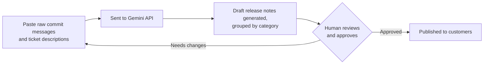

# Release Notes Assistant

A command-line tool that turns raw implementation tickets and commit
messages into clean, customer-readable release notes, grouped into
categories using the Gemini API.

Any entry too vague to describe safely is flagged for human review instead
of being guessed at, and every output ends with a reminder that a human
must review and approve it before publishing.

## Setup

1. Create a `.env` file in the project root with your Gemini API key:

   ```
   GEMINI_API_KEY=your-key-here
   ```

2. Install dependencies:

   ```
   pip install -r requirements.txt
   ```

## Running it

### Directly with Python

```
python release_notes.py
```

### With Docker

```
docker build -t release-notes-assistant .
docker run -it --env-file .env release-notes-assistant
```

The `--env-file .env` flag passes your API key into the container at run
time. The key is never baked into the image itself.

## Example run

```
Release Notes Assistant

Paste commit messages and ticket titles/descriptions below (multiple lines OK).
Type a line with just END when you're done, or type quit to exit.

Fixed null pointer exception when user has no profile picture
Added dark mode toggle to settings page
fix stuff
Refactored internal caching layer for 20% faster load times
END

**Features**
* You can now enable dark mode in your settings.

**Fixes**
* Resolved an error that occurred for users who do not have a profile picture.

**Improvements**
* Optimized performance to make loading times up to 20% faster.

**Needs Human Review**
* "fix stuff"

---
This output was generated by AI and must be reviewed and approved by a
human before publishing.

(Saved to release_notes_log.md)
```

Type `quit` at any point instead of pasting to exit the program.

## Logging

Every generated batch is appended to `release_notes_log.md` in this
directory, with a timestamp, so there's a running history of past runs.
This file is not committed to git.

## Workflow

The human-approval step is mandatory, not optional — the tool only ever
produces a draft.



## Future work

The following are intentionally out of scope for this version:

- Reading directly from Git or Jira instead of pasted text
- A web interface
- User accounts

## Cost

Uses only the Gemini free tier (`gemini-flash-latest`). Zero cost to run.
