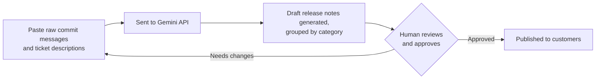

# Release Notes Assistant

A command-line tool that turns raw implementation tickets and commit
messages into clean, customer-readable release notes, grouped into
categories using the Gemini API.

Any entry too vague to describe safely is flagged for human review instead
of being guessed at, and every output ends with a reminder that a human
must review and approve it before publishing.

## Setup

1. Create a `.env` file in the project root with your Gemini API key
   (copy `.env.example` and fill in your key):

   ```
   GEMINI_API_KEY=your-key-here
   ```

2. Install dependencies:

   ```
   pip install -r requirements.txt
   ```

## Running it

### Directly with Python

```
python release_notes.py
```

### With Docker

```
docker build -t release-notes-assistant .
docker run -it --env-file .env release-notes-assistant
```

The `--env-file .env` flag passes your API key into the container at run
time. The key is never baked into the image itself.

## Example run

This is one continuous session: a first batch covering every heading
(including an entry too vague to describe safely), then a second batch
to show the loop, then `quit` to exit. Nothing here is fabricated —
this is a real run against the Gemini API.

```
Release Notes Assistant

Paste commit messages and ticket titles/descriptions below (multiple lines OK).
Type a line with just END when you're done, or type quit to exit.

Added CSV export button to the reports page
Added support for exporting reports to PDF
Fixed crash when opening the app on Android 12
Fixed typo in the password reset email template
Improved search response time by 35%
Updated the footer legal disclaimer text
fix stuff
cleanup
END

### Features
- Added an option to export reports as a CSV file from the reports page.
- Added support for exporting reports as a PDF document.

### Fixes
- Resolved an issue that caused the app to crash when opened on Android 12.
- Fixed a spelling error in the password reset email.

### Improvements
- Improved search speeds, making search results load 35% faster.

### Other
- Updated the legal disclaimer text in the page footer.

### Needs Human Review
- "fix stuff"
- "cleanup"

---
This output was generated by AI and must be reviewed and approved by a
human before publishing.

(Saved to release_notes_log.md)

Paste commit messages and ticket titles/descriptions below (multiple lines OK).
Type a line with just END when you're done, or type quit to exit.

Updated onboarding checklist copy for new users
END

### Improvements
- We updated the text in the onboarding checklist for new users.

---
This output was generated by AI and must be reviewed and approved by a
human before publishing.

(Saved to release_notes_log.md)

Paste commit messages and ticket titles/descriptions below (multiple lines OK).
Type a line with just END when you're done, or type quit to exit.

quit
Goodbye!
```

A few things to notice in the run above:
- Every category heading appears at least once — Features, Fixes,
  Improvements, Other — plus Needs Human Review for the two entries
  ("fix stuff", "cleanup") that were too vague to describe safely; they
  are quoted exactly as pasted, not guessed at.
- Each raw line becomes one short, plain-language sentence with no
  internal jargon or ticket references.
- The program loops for a second, smaller batch without restarting,
  and `quit` exits cleanly at any point.
- The disclaimer line at the end is identical both times — it's added
  by the code itself, not left to the model to remember.

## Running tests

```
python -m unittest test_release_notes.py -v
```

These cover prompt building and log writing. They don't call the
Gemini API, so no API key or network access is needed to run them.

## Logging

Every generated batch is appended to `release_notes_log.md` in this
directory, with a timestamp, so there's a running history of past runs.
This file is not committed to git.

## Workflow

The human-approval step is mandatory, not optional — the tool only ever
produces a draft.



## Future work

The following are intentionally out of scope for this version:

- Reading directly from Git or Jira instead of pasted text
- A web interface
- User accounts

## Cost

Uses only the Gemini free tier (`gemini-flash-latest`). Zero cost to run.
